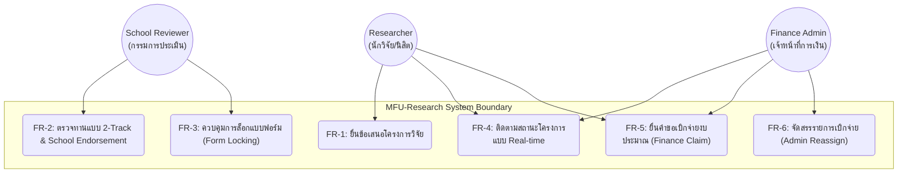
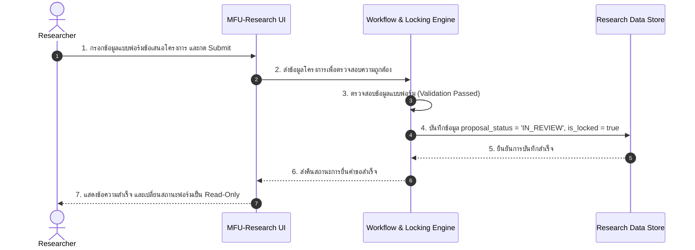
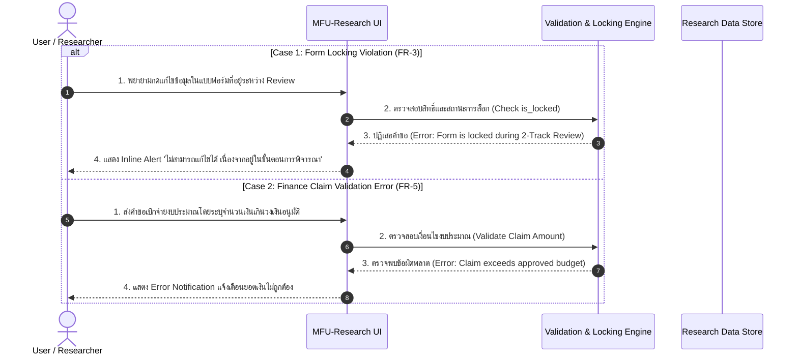

# Design Document: MFU-Research Management System

## 1. System Architecture Overview
ระบบถูกออกแบบด้วยสถาปัตยกรรมแบบ Modular UI-Centric Architecture เพื่อรองรับการทำงานของ Clickable Prototype และจำลอง Logic การทำงานของระบบ MFU-Research:

* **Presentation Layer (UI Component)**: ส่วนต่อประสานผู้ใช้สำหรับนักวิจัย (Researchers), กรรมการประเมิน (Reviewers), และเจ้าหน้าที่การเงิน (Finance Admins)
* **Business Logic Layer (Form & Workflow Manager)**: ระบบประมวลผลเงื่อนไขทางธุรกิจ เช่น กฎการล็อกแบบฟอร์ม (Form-Level Locking Rules) ตามสถานะการรีวิว และการจัดสรรงาน (Admin Reassign)
* **Data Mocking Layer (In-Memory Data Store)**: โครงสร้างข้อมูลจำลองสำหรับเก็บข้อมูลข้อเสนอโครงการ (Proposals) และคำขอเบิกจ่าย (Finance Claims)

---

## 2. UML Diagrams

### 2.1 Use Case Diagram
แสดงขอบเขตการทำงานของระบบ MFU-Research ที่ครอบคลุม Must-Have Functional Requirements (FR-1 ถึง FR-6)



---

### 2.2 Sequence Diagrams

#### Sequence Diagram 01: Happy Path (การยื่นแบบฟอร์มและการล็อกฟอร์มระหว่างรีวิว)

กระบวนการยื่นข้อเสนอโครงการวิจัย (FR-1) และการเข้าสู่กระบวนการตรวจทาน 2-Track Review พร้อมสั่งเปิดใช้งาน Form Locking (FR-2, FR-3)



#### Sequence Diagram 02: Unhappy Path (การพยายามแก้ไขฟอร์มขณะถูกล็อก / ข้อผิดพลาดคำขอเบิกจ่าย)

กระบวนการจัดการข้อผิดพลาดเมื่อผู้ใช้พยายามแก้ไขข้อมูลระหว่างที่ระบบล็อกแบบฟอร์ม (FR-3) หรือกรอกข้อมูลเบิกจ่ายไม่ครบถ้วน (FR-5)



---

## 3. Data Model & Database Schema

โครงสร้างจัดเก็บข้อมูลหลักเพื่อรองรับกระบวนการวิจัยและการเงิน

### Table Specifications

#### Table 1: `users`

| Attribute | Data Type | Key | Constraint | Description |
| --- | --- | --- | --- | --- |
| `user_id` | VARCHAR(36) | PK | NOT NULL, UNIQUE | รหัสประจำตัวผู้ใช้ |
| `full_name` | VARCHAR(100) | - | NOT NULL | ชื่อ-นามสกุล |
| `role` | VARCHAR(20) | - | CHECK (role IN ('RESEARCHER', 'REVIEWER', 'FINANCE_ADMIN')) | บทบาทผู้ใช้งาน |
| `school` | VARCHAR(100) | - | NOT NULL | สำนักวิชาที่สังกัด |

#### Table 2: `proposals` (FR-1, FR-2, FR-3, FR-4)

| Attribute | Data Type | Key | Constraint | Description |
| --- | --- | --- | --- | --- |
| `proposal_id` | VARCHAR(36) | PK | NOT NULL, UNIQUE | รหัสข้อเสนอโครงการ |
| `researcher_id` | VARCHAR(36) | FK | REFERENCES users(user_id) | รหัสผู้ยื่นโครงการ |
| `title` | VARCHAR(200) | - | NOT NULL | ชื่อโครงการวิจัย |
| `status` | VARCHAR(30) | - | DEFAULT 'DRAFT' | สถานะ (DRAFT, IN_REVIEW, APPROVED, REJECTED) |
| `is_locked` | BOOLEAN | - | DEFAULT FALSE | สถานะการล็อกแบบฟอร์ม (FR-3) |
| `created_at` | TIMESTAMP | - | DEFAULT CURRENT_TIMESTAMP | เวลาที่สร้างรายการ |

#### Table 3: `finance_claims` (FR-5, FR-6)

| Attribute | Data Type | Key | Constraint | Description |
| --- | --- | --- | --- | --- |
| `claim_id` | VARCHAR(36) | PK | NOT NULL, UNIQUE | รหัสคำขอเบิกจ่าย |
| `proposal_id` | VARCHAR(36) | FK | REFERENCES proposals(proposal_id) | รหัสโครงการวิจัยที่อ้างอิง |
| `amount` | DECIMAL(10,2) | - | NOT NULL | จำนวนเงินที่ขอเบิก |
| `claim_status` | VARCHAR(30) | - | DEFAULT 'SUBMITTED' | สถานะการเบิกจ่าย |
| `assigned_admin_id` | VARCHAR(36) | FK | REFERENCES users(user_id) | เจ้าหน้าที่การเงินที่ได้รับมอบหมาย (FR-6) |

---

## 4. UI Screen Mapping & State Matrix

ตารางเชื่อมโยงการแสดงผลบนหน้าจอ UI เข้ากับ Requirement และแผนการจัดการ Error State

| UI Screen ID | Screen Name | Mapped FR | Target Component / Action | State Handled (Happy / Unhappy) |
| --- | --- | --- | --- | --- |
| `UI-01` | Proposal Submission Form | FR-1, FR-3 | ปุ่ม "Submit Proposal" | **Happy**: บันทึกสำเร็จ -> ล็อกแบบฟอร์ม -> ไปหน้า `UI-03`<br>

<br>**Unhappy**: หากอยู่ในช่วง Review จะปิดการแก้ไข (Disabled Form Fields) |
| `UI-02` | 2-Track Review Dashboard | FR-2 | ปุ่ม "Approve / Reject / Endorse" | **Happy**: อัปเดตสถานะโครงการสำเร็จ<br>

<br>**Unhappy**: แสดงข้อความแจ้งเตือนเมื่อลงความเห็นไม่ครบตาม Track |
| `UI-03` | Project Status Tracker | FR-4 | Timeline Indicator | **Happy**: แสดงสถานะ Real-time พร้อม Progress Bar<br>

<br>**Unhappy**: แสดง Empty State หากไม่พบบันทึกโครงการ |
| `UI-04` | Finance Claim Panel | FR-5, FR-6 | ปุ่ม "Submit Claim" / "Reassign Admin" | **Happy**: สร้างคำขอเบิกจ่ายและแจกจ่ายงานให้ Admin สำเร็จ<br>

<br>**Unhappy**: แสดง Error Alert เมื่อยอดเงินเกินวงเงิน หรือไม่เลือก Admin |

```

```
